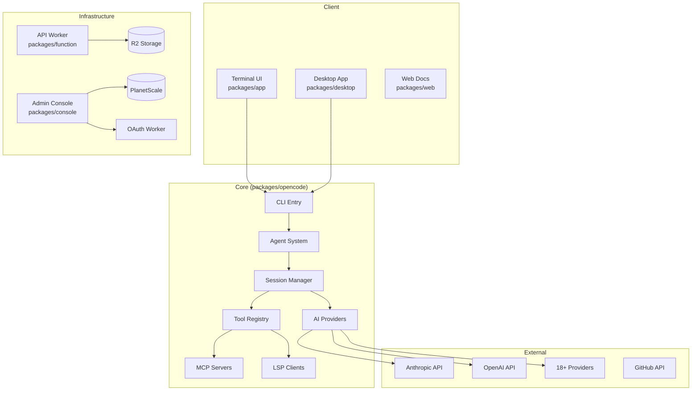
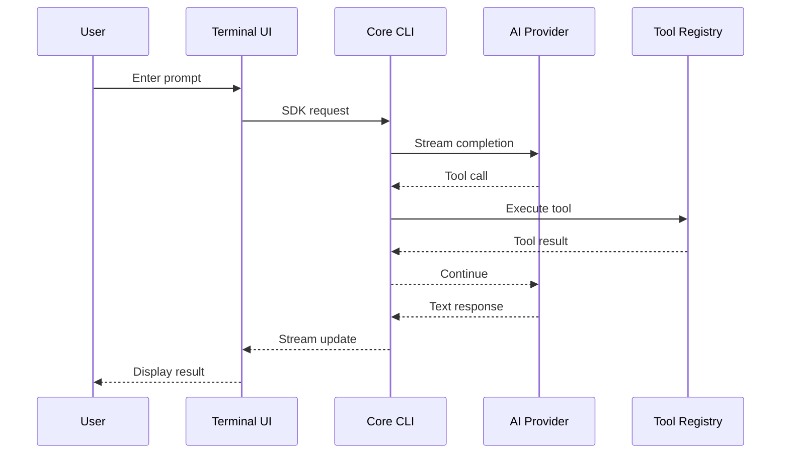
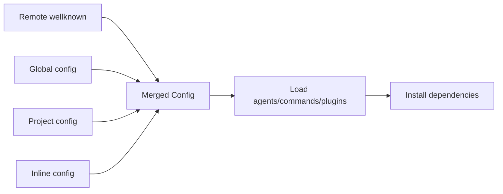
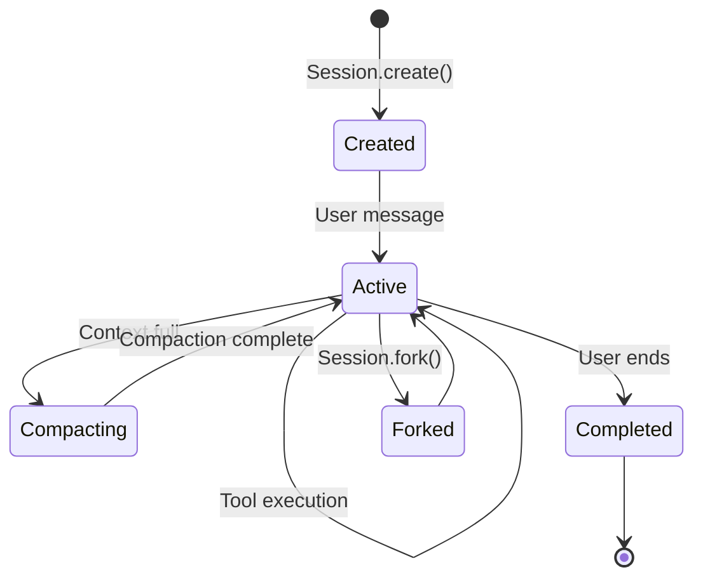

# OpenCode Codebase Map

> Auto-generated by Cartographer. Last mapped: 2026-01-15

## System Overview

OpenCode is an open-source AI coding agent similar to Claude Code, featuring a terminal-based UI, multi-provider LLM support, and extensible plugin architecture.



## Directory Structure

```
opencode/
├── packages/
│   ├── opencode/          # Core CLI (306 files) - Main agent, tools, providers
│   ├── app/               # Terminal UI (68 files) - SolidJS TUI application
│   ├── ui/                # Shared UI (68 files) - Component library, themes
│   ├── desktop/           # Tauri Desktop (284 files) - Native desktop wrapper
│   ├── console/           # Admin Console (149 files)
│   │   ├── app/           # SolidStart web app
│   │   ├── core/          # Business logic (Drizzle ORM)
│   │   ├── function/      # Auth/log Workers
│   │   ├── mail/          # Email templates
│   │   └── resource/      # Environment adapters
│   ├── web/               # Landing/Docs (16 files) - Astro + Starlight
│   ├── sdk/               # JavaScript SDK (40 files) - OpenAPI-generated
│   ├── plugin/            # Plugin Framework (6 files) - Hook system
│   ├── extensions/        # IDE Extensions - Zed integration
│   ├── function/          # Serverless API (2 files) - Durable Objects
│   └── ...                # enterprise, identity, slack, util, script
├── infra/                 # SST Infrastructure - Cloudflare + PlanetScale
├── github/                # GitHub Action - Issue/PR automation
├── nix/                   # Nix Packaging - Reproducible builds
├── sdks/vscode/           # VSCode Extension
├── specs/                 # Architecture Decision Records
├── themes/                # Color Schemes
└── .opencode/             # Project Configuration
```

## Module Guide

### packages/opencode - Core CLI

**Purpose**: Main AI coding agent with tool execution, provider integration, and session management

**Entry Point**: `src/index.ts`

**Key Modules**:

| Module | Purpose | Key Files |
|--------|---------|-----------|
| `agent/` | Agent registry and prompt system | agent.ts, prompt/*.txt |
| `tool/` | 20+ tool implementations | bash.ts, edit.ts, read.ts, task.ts |
| `provider/` | 18+ AI provider integrations | provider.ts, models.ts, sdk/* |
| `session/` | Conversation lifecycle | index.ts, llm.ts, system.ts |
| `mcp/` | Model Context Protocol client | index.ts, oauth-*.ts |
| `lsp/` | Language Server Protocol client | client.ts, server.ts |
| `config/` | Layered configuration system | config.ts (1222 lines!) |
| `permission/` | Fine-grained access control | next.ts, index.ts |
| `cli/` | CLI commands and TUI | cmd/*, ui.ts, bootstrap.ts |
| `server/` | HTTP API (Hono) | server.ts, tui.ts |
| `storage/` | Persistent storage layer | storage.ts |
| `plugin/` | Plugin loader and hooks | index.ts, codex.ts |

**Native Agents**: build (full access), plan (read-only), general (subagent), explore, compaction

**Built-in Tools**: bash, edit, read, write, glob, grep, ls, multiedit, task, webfetch, websearch, lsp, todo, patch, plan, question, skill

**Bundled Providers**: Anthropic, OpenAI, Azure, Google (Gemini/Vertex), Groq, Mistral, Cerebras, Cohere, DeepInfra, OpenRouter, Together, Perplexity, xAI, GitHub Copilot, GitLab Duo, Vercel

---

### packages/app - Terminal UI

**Purpose**: SolidJS-based terminal application with session management, file viewing, and terminal integration

**Entry Point**: `src/entry.tsx`

**Key Components**:

| Component | Purpose |
|-----------|---------|
| `pages/session.tsx` | Main session view (1702 lines) |
| `components/terminal.tsx` | ghostty-web terminal emulator |
| `components/prompt-input.tsx` | Multi-part prompt input |
| `context/sync.tsx` | Server state synchronization |
| `context/layout.tsx` | Layout persistence (521 lines) |

**Patterns**: 17+ context providers, virtualized turn rendering, WebSocket terminals

---

### packages/ui - Component Library

**Purpose**: Shared UI components, design system, and theming

**Key Components**:

| Component | Purpose |
|-----------|---------|
| `session-turn.tsx` | Turn display (696 lines) |
| `diff.tsx` | File diff viewer (@pierre/diffs) |
| `markdown.tsx` | Safe markdown rendering (DOMPurify) |
| `code.tsx` | Syntax highlighting (Shiki) |
| `theme/` | OKLCH-based theming system |

**Assets**: 60+ Nerd Fonts, 500+ file icons, 50+ provider icons

---

### packages/desktop - Tauri Desktop App

**Purpose**: Native desktop wrapper using Tauri v2 with embedded CLI sidecar

**Architecture**:
- **Rust Backend** (`src-tauri/`): Process management, native APIs
- **TS Frontend** (`src/`): Platform adapter, server gate

**Key Features**:
- Sidecar server with health checks and auto-restart
- Windows Job Objects for reliable process cleanup
- Auto-update via Tauri updater
- CLI version sync on startup

---

### packages/console - Admin Console

**Purpose**: Workspace management, billing, user administration

**Subpackages**:
- `app/` - SolidStart web application
- `core/` - Drizzle ORM business logic
- `function/` - OpenAuth issuer, log processor
- `mail/` - JSX Email templates
- `resource/` - Environment-aware resource access

**Key Entities**: Account, Workspace, User, Billing, Key, Model, Provider

---

### packages/sdk - JavaScript SDK

**Purpose**: Auto-generated TypeScript SDK from OpenAPI specification

**Exports**:
```typescript
import { createOpencodeClient } from "@opencode-ai/sdk"
import { createOpencodeServer, createOpencodeTui } from "@opencode-ai/sdk/server"
import { createOpencode } from "@opencode-ai/sdk/v2"
```

**40+ Operations**: session CRUD, project management, PTY, config, tools

---

### packages/plugin - Plugin Framework

**Purpose**: Hook-based extensibility for tools, auth, and event handling

**Available Hooks**:
- `chat.message`, `chat.params` - Message handling
- `tool.execute.before/after` - Tool interception
- `permission.ask` - Permission customization
- `auth` - OAuth/API key flows

---

### infra/ - Infrastructure

**Purpose**: SST infrastructure-as-code for Cloudflare deployment

**Stacks**:
- `app.ts` - API Worker, Web docs, WebApp
- `console.ts` - PlanetScale DB, Auth, Console
- `enterprise.ts` - Teams/Enterprise with R2

**Domains**:
- `opencode.ai` - Console
- `docs.opencode.ai` - Documentation
- `api.opencode.ai` - API Worker
- `app.opencode.ai` - Web App
- `auth.opencode.ai` - OAuth
- `opncd.ai` - Enterprise

---

### github/ - GitHub Action

**Purpose**: `/opencode` or `/oc` trigger for issue/PR automation

**Features**:
- OIDC token exchange for GitHub App
- Full PR/Issue context extraction
- Session streaming with live updates
- Auto-sharing for public repos

---

### nix/ - Nix Packaging

**Purpose**: Reproducible cross-platform builds

**Targets**: aarch64-linux, x86_64-linux, aarch64-darwin, x86_64-darwin

**Packages**: `opencode` (CLI), `opencode-desktop` (Tauri)

---

### sdks/vscode - VSCode Extension

**Purpose**: Integrated terminal with keyboard shortcuts

**Commands**:
- `cmd+escape` - Open opencode terminal
- `cmd+shift+escape` - New terminal tab
- `cmd+alt+k` - Add filepath to prompt

---

## Data Flow

### User Interaction Flow



### Configuration Loading



### Session Lifecycle



## Conventions

### Naming
- **TypeScript**: camelCase for functions/variables, PascalCase for types/classes
- **Files**: kebab-case for files, index.ts for module exports
- **IDs**: ULID with prefixes (`session_`, `usr_`, `wrk_`)

### Patterns
- **Instance-Scoped State**: Cleanup via `Instance.dispose()`
- **Event Bus**: Pub/sub for decoupled communication
- **Function Factory**: `fn(schema, callback)` with Zod validation
- **Actor Pattern**: Request-scoped authorization context

### Style
- Prefer `const` over `let`
- Early returns over `else` blocks
- Single-word variable names where sensible
- Bun APIs over Node APIs

## Gotchas

### Critical
1. **Process Exit**: Main entry force-exits to kill hanging MCP servers
2. **Permission Cascade**: First matching rule wins (not most specific)
3. **Config Interpolation**: `{env:VAR}` and `{file:path}` substitution
4. **System Prompts**: Different prompts per provider (Anthropic/GPT/Gemini)

### Important
5. **Turn Virtualization**: Only renders last 20 messages initially
6. **Terminal Clone**: Creates new PTY when reconnection fails
7. **MCP Timeout**: 30s default for connections and tool calls
8. **LSP Timeout**: 45s for server initialization
9. **Plugin Deduplication**: Later entries win when same plugin loaded

### Build System
10. **Bun Version**: Exact 1.3.6 required (enforced)
11. **Nix WASM Patching**: Tree-sitter paths rewritten to Nix store
12. **Desktop Sidecar**: CLI pre-built and copied before Tauri build
13. **Windows Job Objects**: Required for reliable process cleanup

## Navigation Guide

**To add a new tool**:
1. Create `packages/opencode/src/tool/mytool.ts` - Implementation
2. Create `packages/opencode/src/tool/mytool.txt` - Usage instructions for AI
3. Register in `packages/opencode/src/tool/registry.ts`
4. Add permission rule if needed

**To add a new AI provider**:
1. Create loader in `packages/opencode/src/provider/sdk/`
2. Add to provider list in `packages/opencode/src/provider/provider.ts`
3. Add model definitions in `packages/opencode/src/provider/models.ts`

**To add a new agent**:
1. Create `.opencode/agent/myagent.md` with frontmatter
2. Or add to config in `packages/opencode/src/agent/agent.ts`

**To modify the TUI**:
1. Components in `packages/app/src/components/`
2. Pages in `packages/app/src/pages/`
3. Contexts in `packages/app/src/context/`

**To update infrastructure**:
1. Modify `infra/*.ts` files
2. Deploy with `bun sst deploy --stage=<stage>`

**To publish a release**:
1. Merge to dev branch
2. Run publish.yml workflow with version bump
3. Workflow builds all platforms and creates draft release

## Technology Stack

| Layer | Technology |
|-------|------------|
| **Runtime** | Bun 1.3.6 |
| **Language** | TypeScript 5.8.2 |
| **UI Framework** | SolidJS 1.9.10 |
| **HTTP Server** | Hono 4.10.7 |
| **Desktop** | Tauri v2 (Rust) |
| **Terminal** | ghostty-web (WASM) |
| **Database** | PlanetScale (MySQL) |
| **ORM** | Drizzle |
| **Deployment** | Cloudflare Workers/Pages |
| **Infrastructure** | SST 3.17.23 |
| **Build System** | Turborepo, Nix |
| **AI SDK** | Vercel AI SDK 5.0.119 |
| **Syntax Highlighting** | Shiki 3.20.0 |
| **Markdown** | Marked 17.0.1 |

## External Resources

- **Website**: https://opencode.ai
- **Documentation**: https://opencode.ai/docs
- **Discord**: https://opencode.ai/discord
- **GitHub**: https://github.com/anomalyco/opencode
- **NPM**: https://www.npmjs.com/package/opencode-ai
